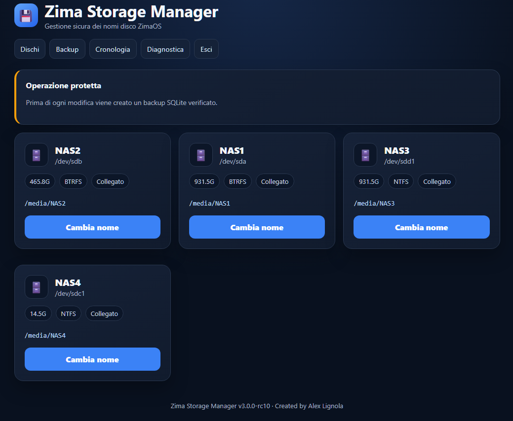

# Zima Storage Manager

Interfaccia web per gestire in modo sicuro i nomi dei dischi e i punti di montaggio utilizzati da ZimaOS.

## Anteprima




## Anteprima


> Zima Storage Manager modifica il nome con cui ZimaOS registra e monta il disco, mantenendo coerenti il database Local Storage e il percorso di montaggio.

## Funzioni principali

- rilevamento automatico dei dischi registrati in ZimaOS;
- rinomina dei dischi e dei punti di montaggio;
- mantenimento del percorso originale;
- aggiornamento sicuro del database Local Storage;
- backup automatici prima delle modifiche;
- creazione di backup manuali;
- ripristino del database;
- verifica dell'integrità SQLite;
- cronologia delle operazioni;
- autenticazione web;
- protezione CSRF;
- conferma delle operazioni critiche;
- diagnostica del sistema;
- rilevamento automatico del servizio Local Storage;
- installazione nativa tramite systemd;
- installazione containerizzata tramite Docker;
- supporto ZimaOS App Store;
- immagini multiarch `amd64` e `arm64`;
- aggiornamenti tramite GitHub Actions.

## Compatibilità verificata

La versione `v3.0.0-rc4` è stata provata su:

```text
ZimaOS 1.6.2
Database: /var/lib/casaos/db/local-storage.db
Servizio: zimaos-local-storage.service
Porta Web: 8787
Architettura testata: amd64